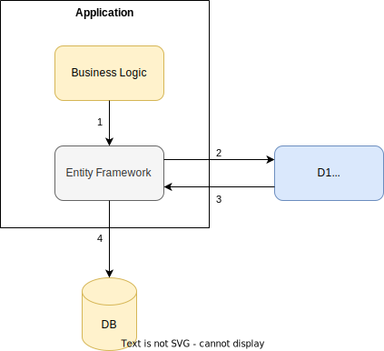

# User manual

This manual is designed to be readable by someone with basic knowledge of [Entity Framework Core](https://docs.microsoft.com/en-us/ef/core/).
It is recommend to have a high-level understanding of [Encryptonize&reg;](https://github.com/cyber-crypt-com/encryptonize-core/), but it is not a strict requirement.

- [User manual](#user-manual)
  - [Overview](#overview)
  - [Supported data types](#supported-data-types)
  - [Storage format](#storage-format)
    - [Overhead](#overhead)
      - [Text data](#text-data)
      - [Binary data](#binary-data)
    - [Example](#example)
  - [Usage](#usage)
    - [Configure data context](#configure-data-context)
      - [Using data annotations](#using-data-annotations)
      - [Using Fluent API](#using-fluent-api)
    - [Configure data model](#configure-data-model)
      - [Using data annotations](#using-data-annotations-1)
      - [Using Fluent API](#using-fluent-api-1)
    - [Storing data](#storing-data)
    - [Querying encrypted data](#querying-encrypted-data)
    - [Fetching encrypted data](#fetching-encrypted-data)
  - [Migrating existing data](#migrating-existing-data)
    - [Example](#example-1)
  - [Limitations](#limitations)

## Overview

The integration works by encrypting and decrypting data transparently, using [Encryptonize&reg;](https://github.com/cyber-crypt-com/encryptonize-core/) when querying or storing in the database. Selected parts of the data is encrypted from the application to the database in such a way that the database itself never receives the data in plain text.

When data is stored in the database the data will be encrypted by making a request to the Encryptonize service, before it is stored in the database. An exception is thrown if the application does not have permissions to encrypt data or the Encryptonize service is not available.



When data is queried, data will automatically be decrypted by making a request to the Encryptonize service, before the data is returned to the caller. If the decryption for some reason fails, for example if the application does not have access to the data or the data is corrupt, an exception will be thrown and the data will not be returned to the caller.


## Supported data types

The following data types are supported:

- `string`
- `byte[]`

In the future, more data types will be supported.

## Storage format

Encrypted data is stored in the column as defined by the data model, but the size of the column increases in size, as the object ID of the encrypted data is prepended to the data and the encryption itself has some overhead, see the [Encryptonize&reg; Core documentation](https://github.com/cyber-crypt-com/encryptonize-core/tree/master/documentation) for more information about object IDs.

### Overhead

#### Text data

The overhead of encrypting text data is:

- Object ID prefix: 36 bytes
- Encryption overhead: 48 bytes
- Base64 encoding: 33 - 36%

Total overhead: Text + 84 bytes + ~34%

#### Binary data

The overhead of encrypting binary data is:

- Object ID prefix: 36 bytes
- Encryption overhead: 48 bytes

Total overhead: Data + 84 bytes

### Example

Consider a databases table with the following schema:

| Column name   | Data type    |
| ------------- | ------------ |
| Id            | INT          |
| Name          | VARCHAR(100) |
| SensitiveData | VARCHAR(MAX) |

Without encryption the content could look like this:

| Id | Name     | SensitiveData       |
| -- | -------- | ------------------- |
| 1  | John Doe | Johns secret data |
| 2  | Jane Doe | Janes secret data |

When the data is encrypted the content will look similar to:

| Id | Name     | SensitiveData       |
| -- | -------- | ------------------- |
| 1  | John Doe | TURaa1pqUmhOR1V0WkRJM05TMDBNekEzTFRnNE9XUXRPR00yTlRjMk5Ea3lPVEpsVytrdXJHcDYveTR1NEM3Q0xsL2NMbUl1TGk0dUxpNHVSVVRSTGk1QVl5ND0= |
| 2  | Jane Doe | Tm1JMU1XTm1NV1l0TnpnMVppMDBZMlJsTFdKa05qRXRaRFkwTXpaaU1tSmlOV1E0cFM1UVlDREc5UzVMOUt1L2VzcXhaeTR1WDhzdzdrdzZXRmMyNnRyRXBMdz0= |

As you can see the size of the data increases for a couple of reasons:

- Object ID is added to the data
- Encryption overhead
- Base64 encoding (text data only)

## Usage

The integration works by hooking into the Entity Framework Core and intercepting reads and writes to the database.

From a developers point of view there are minimal changes needed to enable encryption, and no changes to the business logic is needed.

Encryption can be enabled in the two standard ways to configure Entity Framework Core using data annotations or the fluent API.

### Configure data context

#### Using data annotations

The `DbContext` needs to be configured to use the Encryptonize&reg; integration, by overriding the `OnModelCreating` method and injecting an instance of `IEncryptonizeClient`.

```csharp
using Microsoft.EntityFrameworkCore;
using Encryptonize.EntityFramework;
using Encryptonize.Client;

public class Program
{
    public static void Main()
    {
        var client = new EncryptonizeClient("https://localhost:9000", "username", "password");
        var databaseContext = new DatabaseContext(client);

    }
}

public class DatabaseContext : DbContext
{
    private readonly IEncryptonizeClient client;

    public DbSet<Person> Persons { get; set; };

    public DatabaseContext(IEncryptonizeClient client)
    {
        this.client = client;
    }

    protected override void OnModelCreating(ModelBuilder modelBuilder)
    {
        modelBuilder.UseEncryptonize(client);
        base.OnModelCreating(modelBuilder);
    }
}
```

#### Using Fluent API

When using the Fluent API you mark the properties that should be encrypted when configuring the data context.

Marking the property as confidential is done using the `IsConfidential` extension method.

If no properties are marked as confidential no encryption will happen, and the data will be stored in the database without any modification and without communicating the the Encryptonize&reg; service.

```csharp
using Microsoft.EntityFrameworkCore;
using Encryptonize.EntityFramework;
using Encryptonize.Client;

public class Program
{
    public static void Main()
    {
        var client = new EncryptonizeClient("https://localhost:9000", "username", "password");
        var databaseContext = new DatabaseContext(client);

    }
}

public class DatabaseContext : DbContext
{
    private readonly IEncryptonizeClient client;

    public DbSet<Person> Persons { get; set; };

    public DatabaseContext(IEncryptonizeClient client)
    {
        this.client = client;
    }

    protected override void OnModelCreating(ModelBuilder modelBuilder)
    {
        modelBuilder.Entity<Person>().Property(x => x.SocialSecurityNumber).IsConfidential(client);
    }
}
```

### Configure data model

#### Using data annotations

You also have to indicate what properties that should be encrypte by adding the `Confidential` attribute to the property. Multiple properties can be marked as confidential in each model.

If no properties are marked as confidential no encryption will happen, and the data will be stored in the database without any modification and without communicating the the Encryptonize&reg; service.

```csharp
using Microsoft.EntityFrameworkCore;
using Encryptonize.EntityFramework;
using Encryptonize.Client;

public class Person
{
    public int Id { get; set; }

    public string FirstName { get; set; }

    public string Surname { get; set; }

    [Confidential]
    public string SocialSecurityNumber { get; set; }
}
```

#### Using Fluent API

When using the Fluent API no changes to the data model is needed, as all the configuration happens in the data context.

```csharp
using Microsoft.EntityFrameworkCore;
using Encryptonize.EntityFramework;
using Encryptonize.Client;

public class Person
{
    public int Id { get; set; }

    public string FirstName { get; set; }

    public string Surname { get; set; }

    public string SocialSecurityNumber { get; set; }
}
```

### Storing data

Storing encrypted data requires no code changes, and works exactly like regular Entity Framework Core.

Before data is sent to the database it is automatically encrypted as described in the [Overview section](#overview).

```csharp
var person = new Person { Firstname = "John", Surname = "Doe", SocialSecurityNumber = "123456789" };
await dbContext.Persons.AddAsync(person);
await dbContext.SaveChangesAsync();
```

### Querying encrypted data

All querying and processing of encrypted data has to be done client side, as the database is not able to decrypt the data.

For example if you want to filter on `SocialSecurityNumber` you have to fetch the data from the database first, and then filter in memory:

```csharp
var persons = await dbContext.Persons.ToListAsync().Where(x => x.SocialSecurityNumber === "123456789");
```

### Fetching encrypted data

Just like storing encrypted data, fetching encrypted data does not require any code changes, and works like regular Entity Framework Core.

Before data is passed to the business logic it is automatically decrypted as described in the [Overview section](#overview).

```csharp
var person = await dbContext.Documents.FirstOrDefaultAsync(x => x.Firstname == "John");
```

## Migrating existing data

Migrating unencrypted data to encrypted data is a simple but time consuming task, as all data needs to be read from the database, encrypted and then stored. A migrator is provided helping you to complete this task.

To avoid the need for down time a new column, marked as confidential, has to be added to the table. This method allows you to have the migration running as a background task, while the application is fully operational.

If downtime is not acceptable, it is recommended to change the business logic to use the new column if encrypted data is available, and fallback to the unencrypted data if needed.

### Example

The data model is updated with a column marked as confidential, below indicated by `EncryptedData`.

```csharp
public class MigrationData
{
    public int Id { get; set; }

    public string UnencryptedData { get; set; }

    [Confidential]
    public string EncryptedData { get; set; }
}
```

The migrator will then read the unecrypted column, and store the value encrypted in the new column.

```csharp
var migrator = new EncryptonizeMigrator<MigrationTestContext>(dbContext, encryptonizeClient);
migrator.Migrate(context => context.Data.Where(model => model.EncryptedData == null), model => model.UnencryptedData, (model, value) => x.EncryptedData = value);
```

## Limitations

Encrypted data cannot be decrypted by the database, meaning that it can not be filtered or processed by the database. Support for searching inside encrypted data is on the roadmap.
